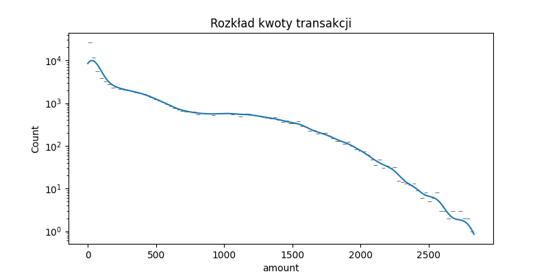
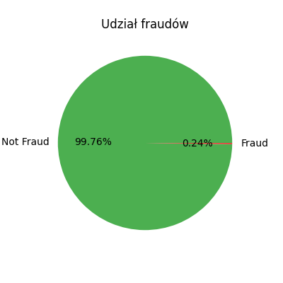
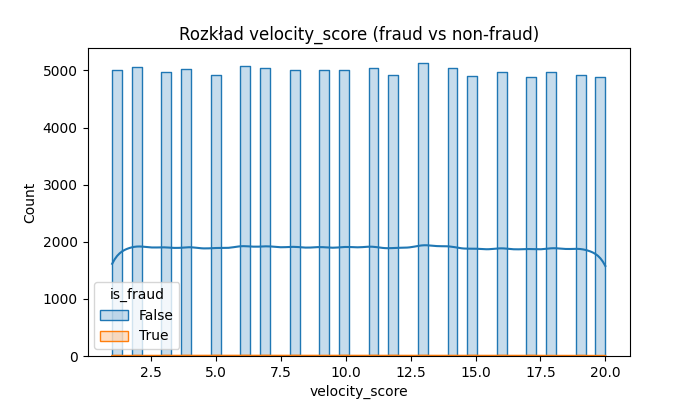

# Financial Fraud Detection — Data Science Pipeline

## Opis projektu

Projekt polegał na detekcji oszustw finansowych (fraud) w syntetycznym zbiorze 5 milionów transakcji. Stworzony pipeline obejmuje eksplorację danych (EDA), inżynierię cech, trenowanie modelu klasyfikacyjnego oraz analizę wyników.

---

## 1. Eksploracyjna analiza danych (EDA)

Pierwszy krok to analiza 100 000 transakcji:

- **Struktura:** 18 kolumn — ID transakcji, czas, nadawca, odbiorca, kwota, typ operacji, kategoria, lokalizacja, urządzenie, cechy behawioralne, metadane oraz fraud label.
- **Zmienna docelowa:** `is_fraud` (0 – brak fraudu, 1 – fraud).
- **Fraud stanowi ok. 0.24% przypadków** (bardzo niezbalansowany zbiór).
- **Typy fraud:** w próbce tylko `card_not_present`.

### Przykładowy kod:
```python
import pandas as pd
df = pd.read_csv("financial_fraud_detection_dataset.csv", nrows=100_000)
print(df.info())
print(df['is_fraud'].value_counts(normalize=True))
print(df['fraud_type'].value_counts(dropna=False))


| Rozkład kwot             | Proporcja fraudów      | Rozkład velocity\_score (fraud vs nie-fraud) |
| ------------------------ | ---------------------- | -------------------------------------------- |
|  |  |              |


2. Feature Engineering
Zakodowano zmienne kategoryczne (transaction_type, merchant_category, device_used, payment_channel, location) metodą LabelEncoder.

Stworzono cechy czasowe:

Godzina, dzień tygodnia, flaga weekendu.

Wybrano cechy numeryczne i behawioralne do modelowania.

Przygotowano dataset do uczenia (processed_sample.csv, processed_data.pkl).

Przykład kodu:
df['timestamp'] = pd.to_datetime(df['timestamp'])
df['hour'] = df['timestamp'].dt.hour
df['dayofweek'] = df['timestamp'].dt.dayofweek
df['is_weekend'] = (df['dayofweek'] >= 5).astype(int)
# ... LabelEncoder ...

3. Trenowanie modelu
Podział na zbiory treningowe i testowe z zachowaniem proporcji klas.

Model:

XGBoostClassifier (200 drzew, skalowanie wag klasy positive).

Metryki:

ROC AUC: 0.89 (bardzo dobry wynik na niezbalansowanym zbiorze!)

Recall (fraud): 0.82 – wykrywa większość fraudów.

Precision (fraud): 0.04 – dużo false positive, ale bardzo mało fraudów w zbiorze.

Accuracy: 0.81

Macierz pomyłek:

[[100775  22958]   # TN, FP
 [   229   1038]]  # FN, TP

Przykład kodu:
from xgboost import XGBClassifier
model = XGBClassifier(...)
model.fit(X_train, y_train)
y_pred = model.predict(X_test)
print(classification_report(y_test, y_pred))
print("ROC AUC:", roc_auc_score(y_test, y_proba))


Wygenerowany wykres:
Ważność cech w modelu:


Wnioski i rekomendacje
Model wykrywa większość fraudów (wysoki recall), co jest kluczowe w systemach antyfraudowych.

Niski precision – model często zgłasza fałszywe alarmy. To normalne przy bardzo niezbalansowanych danych.

Możliwe usprawnienia:

Więcej zaawansowanych cech (np. rolling window, agregacje po kliencie).

Dalsze balansowanie danych (undersampling/oversampling).

Kalibracja progu decyzyjnego.

Wykorzystanie explainability (SHAP/LIME) dla analizy decyzji modelu.

Testy na większym podzbiorze danych (miliony transakcji).

Technologie i biblioteki
Pandas, Numpy — przetwarzanie danych

Matplotlib, Seaborn — wizualizacje

Scikit-learn — inżynieria cech, podział na zbiory

XGBoost — model klasyfikacyjny

Joblib — serializacja danych


1. Analiza EDA
Dane się wczytały, wszystko się zgadza z opisem.

Rozkłady i proporcje fraud/not-fraud oraz typów fraud są ok:

Fraudów jest bardzo mało (około 0,24%!), czyli problem jest bardzo niezbalansowany.

Jedyny typ fraudu w tej próbce to card_not_present (takie były w 100k wierszy).

2. Feature Engineering
Dane zostały poprawnie przetworzone i zakodowane.

Pliki processed_sample.csv oraz processed_data.pkl powstały prawidłowo.

3. Trenowanie modelu XGBoost
Model został wytrenowany bez błędów.

ROC AUC: 0.886 – bardzo dobry wynik na niezbalansowanych danych!

Macierz pomyłek pokazuje, że:

Model dobrze rozpoznaje większość fraudów (Recall = 0.82), ale precision jest niskie (czyli trochę fałszywych alarmów).

Dla nie-fraudów (False) accuracy i precision są bardzo wysokie.

Wykres feature importance został zapisany.

Co oznaczają metryki?
Wysoki recall (0.82) dla fraud: model łapie większość fraudów, to dobrze (ważne w fraud detection!).

Niski precision (0.04) dla fraud: model zgłasza wiele false positive (normalne przy takich proporcjach klas).

Wysoki ROC AUC (0.89): model bardzo dobrze rozróżnia klasy, mimo dużej przewagi klasy majority.

Jeśli chcesz poprawić precision — przykładowe kierunki:
Dalsze feature engineering (np. rolling features, user history, device/ip anomalies).

Dalsze balansowanie danych (undersampling, oversampling, SMOTE, itp.).

Tuning threshold (zmiana progu decyzji, żeby ograniczyć false positive).

Explainability – możesz dodać SHAP/LIME, by zrozumieć decyzje modelu.

